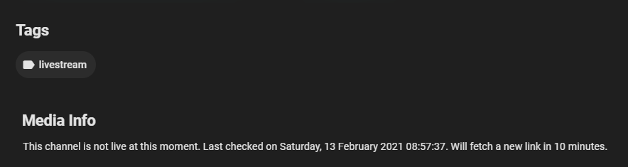

# MediaBrowser.Channels.Twitch
Unofficial twitch channels for Emby Media Center based on IPTV
 

It's not a full fledged twitch plugin with search or trends. You need to manually add your favourites channels in the settings and view on directly on your Emby App whenever they're live.

It a _basic_ plugin to watch twitch streams on emby.

---
## Getting started

**NOTES**: 

> This plugin needs [streamlink](https://github.com/streamlink/streamlink) to get the vod url for the live stream. **The streamlink should be installed and added to system path.** 

> When adding a new channel, it may take a moment to be displayed on dashboard.

>Since Twitch API is not documented, streamlink may stop without notice and so this plugin. Keep streamlink updated.

> The channels will autorefresh every 10 minutes (you can change this value by compiling the plugin yourself). The information is displayed on the channel page:

## Installation

- Checkout the repo and compile the dll using Microsoft Visual Studio 2019.

or

- Download the latest DLL file on the release page of this repo, put it in the "plugins" folder of your Emby Server and restart Emby Server. The plugin should now show up in your Emby Server management page under Advanced > Plugins.

---

_TWITCH, the TWITCH Logo, the Glitch Logo, and/or TWITCHTV are trademarks of Twitch Interactive, Inc. or its affiliates._

