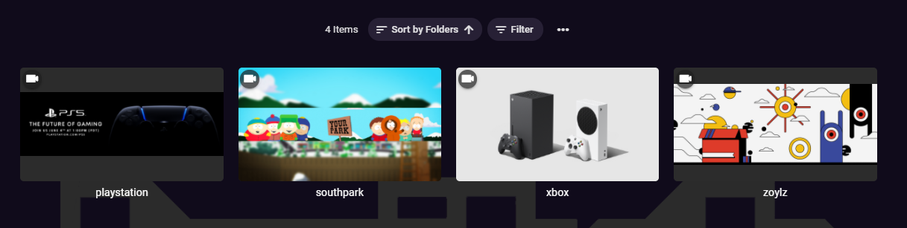

# MediaBrowser.Channels.Twitch
Unofficial twitch channels for Emby Media Center based on IPTV
 

It's not a full fledged twitch plugin with search or trends. You need to manually add your favourites channels in the settings and view on directly on your Emby App whenever they're live.

It a _basic_ plugin so I can watch streams on the TV without extra hardware or steps.

---
## Getting started

- This plugin needs [streamlink](https://github.com/streamlink/streamlink) to get the vod url for the live stream. The streamlink should be installed and on the path. Since Twitch API is not documented, streamlink may stop without notice and so this plugin. Keep streamlink updated.

- Compile using Visual Studio and copy the DLL to Emby plugins directory. Restart the server and go to Plugins -> Twitch. Add your channels, then you can access them from the dashboard.

- A new VoD URL is request when pressing Play on the Video. Sometimes there is a caché and Emby won't process the callback.

---

_TWITCH, the TWITCH Logo, the Glitch Logo, and/or TWITCHTV are trademarks of Twitch Interactive, Inc. or its affiliates._

